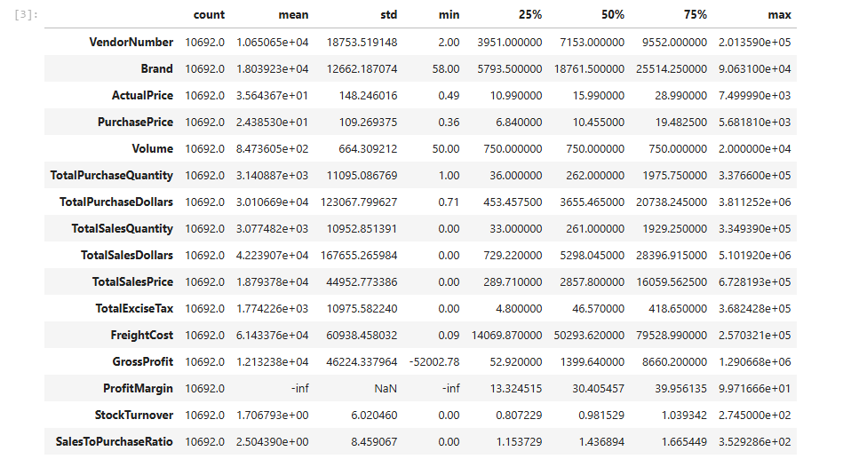
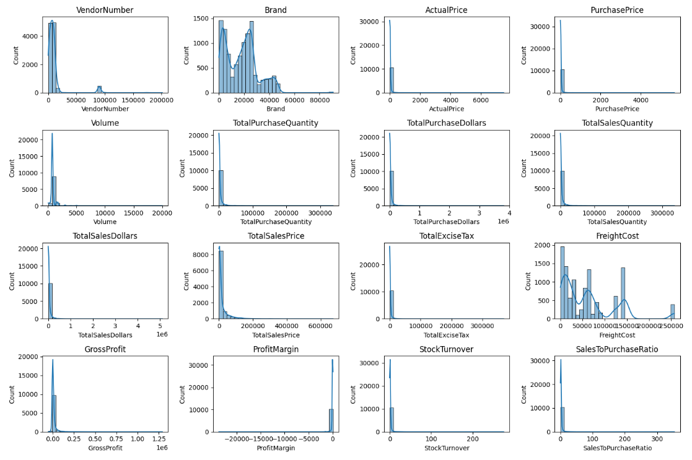
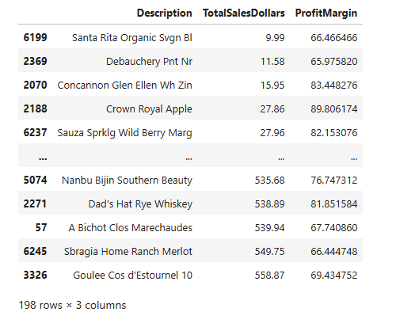
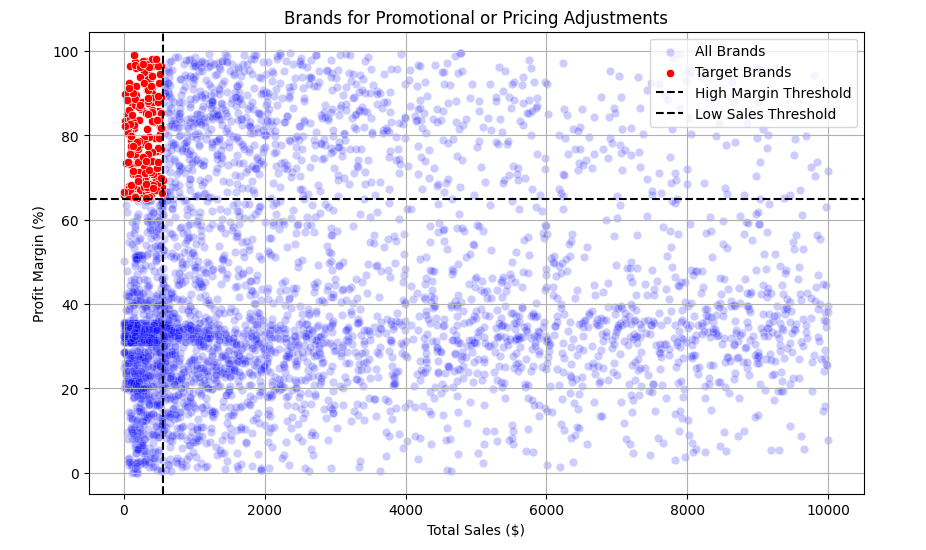
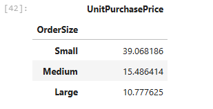

## Project Summary

This project analyzes vendor performance and sales data within an inventory management system, covering the complete data lifecycle—from raw data ingestion and ETL processing to in-depth analysis and interactive visualization. The primary objective is to evaluate vendor efficiency, uncover sales and profitability trends, and generate actionable insights to support data-driven business decisions.

The project demonstrates hands-on expertise in Python, SQL, data analysis, ETL workflows, and Power BI dashboard development.

Key Achievements

##  **Exploratory Data Analysis Overview**

### Summary Statistics

### Distribution plots

## 📊 Summary Statistics Insights

### ⚠️ Negative & Zero Values
- **Gross Profit (Min: -52,002.78)**  
  Some transactions are running at a loss due to high costs or heavy discounting.
- **Profit Margin (Min: -∞)**  
  Revenue is zero or lower than costs, indicating unprofitable sales.
- **Total Sales Quantity & Sales Dollars (Min: 0)**  
  Products were purchased but never sold, suggesting slow-moving or obsolete inventory.

### 🔍 Outliers & High Variability
- **Purchase & Actual Prices**  
  Maximum values (5,681.81 / 7,499.99) compared to low mean values (24.39 / 35.64) indicate the presence of premium or high-end products.
- **Freight Cost (0.09 → 257,032.07)**  
  Large variation points to bulk shipments or inefficiencies in logistics.
- **Stock Turnover (0 → 274.5)**  
  Some products sell extremely fast while others barely move.  
  Stock turnover greater than 1 indicates sales fulfilled from older inventory.

### 💡 Key Takeaways
- Monitor loss-making products and negative margins for corrective action.
- Investigate high freight costs and extreme stock turnover to optimize logistics.
- Implement strategies to reduce slow-moving or obsolete inventory.

## 🧹 Data Filtering

To improve data quality and reliability, the following filters were applied:

- **Gross Profit ≤ 0** – Excluded loss-making transactions.
- **Profit Margin ≤ 0** – Focused analysis on profitable sales.
- **Total Sales Quantity = 0** – Removed items that were never sold.

### Correlation heatmap

## 📈 Correlation Insights

### Purchase Price vs Sales & Profit
- Weak correlation with **Total Sales Dollars (-0.012)** and **Gross Profit (-0.016)**  
  → Price variations have minimal impact on overall revenue or profitability.

### Purchase Quantity vs Sales Quantity
- Strong positive correlation (**0.999**)  
  → Confirms efficient inventory turnover, where purchased quantities are almost fully sold.

### Profit Margin vs Total Sales Price
- Negative correlation (**-0.179**)  
  → Higher sales prices may result in lower profit margins, possibly due to competitive pricing pressures.

### Stock Turnover vs Profitability
- Weak negative correlation with **Gross Profit (-0.038)** and **Profit Margin (-0.055)**  
  → Faster inventory turnover does not necessarily translate into higher profitability.

## Research Questions & Key Findings

### Brands for promotional and pricing adjustments

198 brands exhibit lower sales but higher profit margins, which could benefit from targeting market, promotions or price optimizations to increase volume without compromising profitability.

## 🏢 Top Vendors by Sales & Purchase Contribution

- The **top 10 vendors** contribute **65.69% of total purchases**, while the remaining vendors account for only **34.31%**.
- Over-reliance on a few vendors may introduce **supply chain risks**, highlighting the need for **vendor diversification**.

## 📦 Impact of Bulk Purchasing on Cost Savings

- **Unit Cost Reduction:** Vendors purchasing in large quantities receive a **72% lower unit cost ($10.78 per unit)** compared to smaller orders.  
- **Volume Incentives:** Bulk pricing strategies encourage larger order sizes, effectively increasing total sales volume.  
- **Profitability Optimization:** Scaled purchasing enables the business to maintain strong profit margins while offering competitive market pricing

## 📉 Identifying Vendors with Low Inventory Turnover

- **Total Unsold Inventory Capital:** $2.71M  
- **Impact of Slow-Moving Inventory:** Increases storage costs, reduces cash flow efficiency, and negatively affects overall profitability.  
- **Strategic Benefit:** Identifying vendors with low inventory turnover enables better stock management and minimizes financial strain.

### 📊 Profit Margin Comparison: High vs. Low-Performing Vendors
- **Top Vendors' Profit Margin (95% CI):** 30.74% – 31.61%, **Mean:** 31.17%  
- **Low Vendors' Profit Margin (95% CI):** 40.48% – 42.62%, **Mean:** 41.55%  
- **Performance Analysis:** Low-performing vendors maintain higher margins but struggle with sales volumes, indicating potential pricing inefficiencies or limited market reach.  
- **Actionable Insights for Top-Performing Vendors:** Optimize profitability by adjusting pricing, reducing operational costs, or offering bundled promotions.

